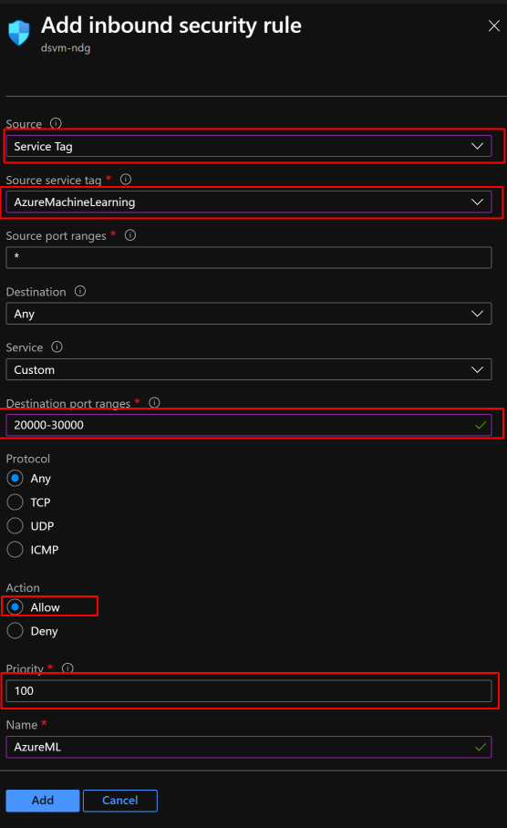
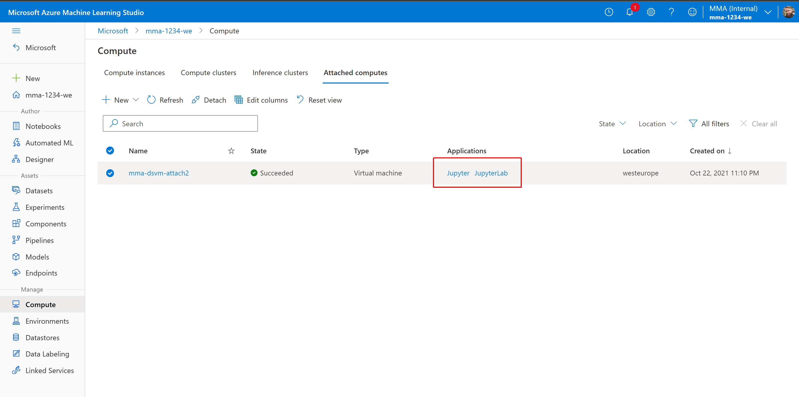

# DSVM Attach to AML Workspace (Preview)

## Overview
Data Science Virtual Machine (DSVM) is unmanaged machine learning workstation. DSVM is recomended for individual data scientists that need a friction-free, pre-configured data science environment since it comes pre-configured and up-to-date ML packages, deep learning frameworks and GPU drivers.

This PREVIEW will provide a delightful DSVM attach to Azure ML so that existing DSVM users can get value-add features and an easier on-ramp to Azure ML.  

 <strong>Keep using DSVM</strong>

 <strong>SSO Applications (e.g. Jupyter)</strong>

 Automatic upgrades of VM Environment (sw/
packages)

 Mounted hosted AML Datastores

 <strong>Ease of access to resource from AML</strong>

 <strong>Fully controlled by org sec policies (VM)</strong>

Interactive job is supported on **AMLArc Compute** and will be available on AmlCompute and Compute Instances in a future release.

## Prerequisites
- Azure ML Workspace -  - if you don't have any please find simple instruction [here](https://docs.microsoft.com/en-us/azure/machine-learning/quickstart-create-resources#create-the-workspace)
- Azure Data Science VM (DSVM) based on Ubuntu (*)- if you don't have any please find simple instructions [here](https://docs.microsoft.com/en-us/azure/machine-learning/data-science-virtual-machine/dsvm-ubuntu-intro)

> Note (*): at this point only Ubuntu based DSVM are supported. Currently only Ubuntu 18.04 is supported.

> Note (INTERNAL): Currently only `centraluseaup` region is supported.

## Get started
### [prereq] Configure DSVM firewal
This step is needed since the Azure ML service needs to have access to the DSVM (for accessing Jupyter noteboks)

1. Go to your DSVM in  [Azure Portal](https://porta.azure.com)

1. Go to Firewall settings and allow inbound connection to service tag `AzureMachineLearning` and for ports `23000-30000` (see below) 

|Parameter|Value|
|------|-----|
|Source|Service Tag|
|Source service tag| AzureMachineLearning|
|Source port ranges| * (any)|
|Destination| Any|
|Service|Custom|
|Destination port ranges| 23000-30000|
|Protocol|Any|
|Action|Allow|
|Priority| something low enough to apply, e.g. 1001|
|Name| name your rule, e.g. AzureML|

### Attach your DSVM to AML Workspace
Now you have everything prepared and can attach your DSVM:

1. Go to [AML Portal](https://ml.azure.com) and select your workspace

1. Select Compute and then Attached Compute 

1. Create new (attched compute - the following screen may vary whether you have already attached compute before) 

1. Name your compute (this name appears in AML Studio) and select your DSVM from your Subscription (dropdown list) and hist "Attach" button (this operation can tak minute or two) 

1. After a while you should see your DSVM to be succesfully attached and also can access your application (Jupyter) via link on the compute row 

You can now work using Jupyter with SSO - try [this tutorial](./docs/attach-dsvm-and-run-simple-notebook.md).

## Known Issues

TBD

## Contact Us
Reach out to us: xxx@microsoft.com if you have any questions or feedback.