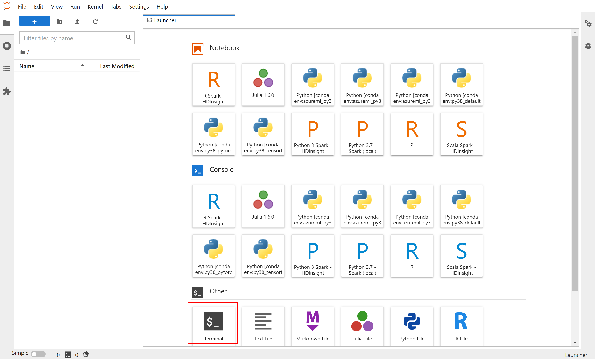
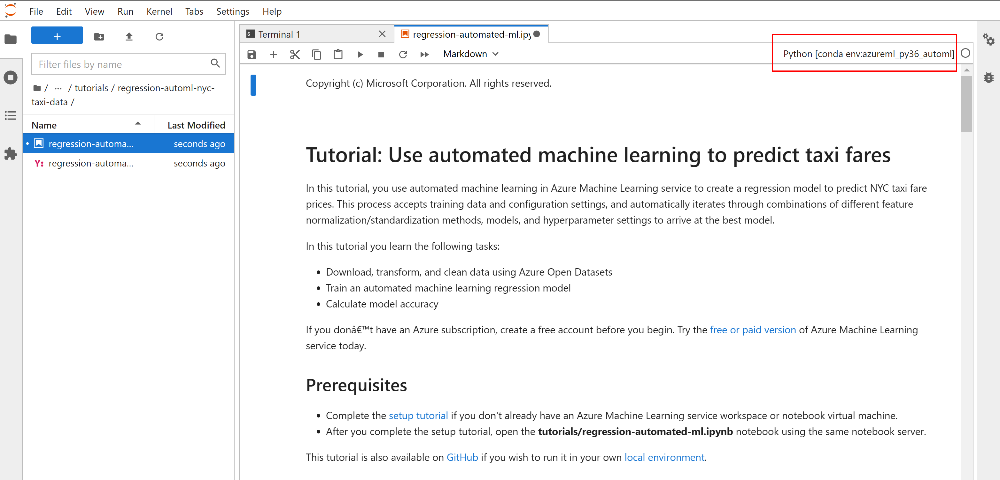
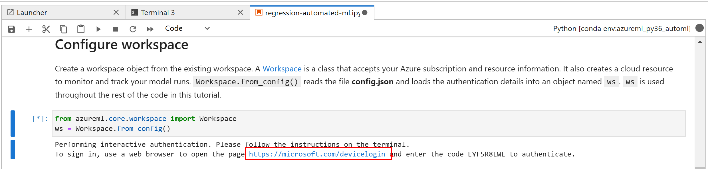

# Tutorial: Track your first experiment with attached Data Science VM

## Prerequisites
- Attached DSVM as per [this article](../README.md)

## How to get to tutorial
1. Open JupyterLab - from the AML Studio, simple go to the currently attached DSVM and select link from Applications:  

1. Open terminal in JupyterLab and download Azure Machine Learning notebooks repository: `git clone https://github.com/Azure/MachineLearningNotebooks.git`  

1. In JupyterLab navigate to cloned folder `MachineLearningNotebooks/tutorials/regression-automl-nyc-taxi-data` and open notebook: `regression-automated-ml.ipynb` and if not already select a Jupyter Kernel `Python [conda env:azureml_py36_automl]`

1. Run individual cells up to "Configure workspace".

1. Notice that you need to log in to Azure ML Workspace but since the `config.json` is already present, you just need to open a given URL with the generated code and specify your AAD credentials. 

1. After successful login you can continue with the rest of the cells.

1. In the end, you will run training a model (in fact numerous models though an AutoML) and display results and visualizations of captured AML runs on your DSVM in Jupyter Widget: 

1. [OPTIONAL] You can also view the run in the Azure ML Studio: 

1. [OPTIONAL] And you can drill to the particular experiment to see all models and their details / metrics. 

## Next Steps
 * You can try other tutorials or sample notebooks from https://github.com/Azure/MachineLearningNotebooks since these are already downloaded in the DSVM
 * You can try to access your previous files / projects in DSVM.
 
## Summary
 * After finishing the tutorial you have succesfully run a AutoML training on your Attached DSVM.
 * Notice that you need to log in to Azure ML Workspace but since the `config.json` is already present, you just specify your AAD credentials.
 * You are able to view logged information of your training in both Jupyter through Widget or in AzureML Studio.
